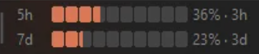
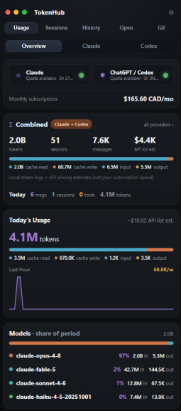

# TokenHub

[](https://github.com/colemclauchlan/TokenHub/releases/latest)
[](LICENSE)
[](https://github.com/colemclauchlan/TokenHub/releases/latest)

Your **real** Claude Code, Claude Cowork and OpenAI Codex usage limits, live on the Windows taskbar.

AI coding subscriptions enforce rolling 5-hour and 7-day limits, and the only way to check them is
to ask the CLI — usually right after it has cut you off mid-task. TokenHub keeps both windows, for
both providers, on the taskbar at all times: exact percentages, reset countdowns, and a status
light that tells you whether your agent is working, waiting on you, or stopped.

**Website:** [tokenhub-ten.vercel.app](https://tokenhub-ten.vercel.app)



## Download

Grab the latest from [**Releases**](https://github.com/colemclauchlan/TokenHub/releases/latest):

| File | What it is |
|---|---|
| `TokenHub_x.y.z_x64_en-US.msi` | Windows installer (recommended) |
| `TokenHub_x.y.z_x64-setup.exe` | NSIS installer |
| `TokenHub.exe` | Portable — no install |

Windows 10/11 only (uses WebView2, which ships with Windows). Binaries are not code-signed yet, so
SmartScreen may warn on first run — or build from source below; the whole pipeline is in this repo.

## Features



- **Taskbar mini-bar** — 5h and 7d limit bars with exact percentages and reset countdowns, docked
  overtop the taskbar. Scroll-wheel flips between Claude and Codex with a prism-roll animation.
- **Agent status light** — green: working, amber: waiting for you, red: stopped. Per provider, so
  the Claude bar only reflects Claude chats and the Codex bar only Codex.
- **Usage analytics** — Overview / Claude / Codex views: tokens, sessions, messages, API-list cost
  estimates, cache read/write/input/output breakdown, today's usage, last-hour rate, 14-day trend,
  per-model share, and a combined monthly subscription total.
- **Live sessions** — every active chat as a card (`REPO — one-line summary`) with an expandable
  per-agent breakdown: model, status, goal. Idle chats drop off after 10 minutes.
- **History** — every past chat grouped by project with totals; rename, delete, or resume a chat in
  its terminal with one click.
- **Git dashboard** — local repos (branch, dirty files, ahead/behind, last commit) plus every repo
  on your connected GitHub accounts.
- **Quality of life** — usage alerts at 75/90/95%, global hotkey `Ctrl+Shift+U`, tray icon styles,
  used-vs-remaining toggle, display profiles, autostart, and an opt-in water-guilt meter.

## How the numbers stay accurate

Two sources, used for different things — on purpose:

| Number | Source |
|---|---|
| 5h / 7d **limit %** | The provider's own usage API, read with your **local OAuth sign-in** — the same source the CLI's counter uses, so the numbers match it exactly |
| Tokens, cost, sessions, models | Your machine's own logs: `%USERPROFILE%\.claude\projects\**\*.jsonl`, `%APPDATA%\Claude\local-agent-mode-sessions\**` (Cowork), `%USERPROFILE%\.codex\sessions\**\rollout-*.jsonl` |

If the usage API is unavailable, TokenHub falls back to a local-log estimate and labels it as such —
you can never mistake a guess for the real number.

## Privacy

Everything is local. There is no server, no telemetry, and no account. Reading the OAuth token is
opt-in and the token never goes anywhere except to the provider that issued it. API keys you enter
are stored in the Windows Credential Manager, encrypted by the OS. Don't take this README's word
for it — the code is all here.

## Build from source

Requires Rust (stable), Node 18+, and the MSVC Build Tools. WebView2 ships with Windows 10/11.

```bash
npm install
npm run dev      # run locally
npm run build    # NSIS + MSI installers in src-tauri/target/release/bundle
```

No local toolchain? Push to a fork — `.github/workflows/build.yml` compiles the installers on a
`windows-latest` runner and uploads them as artifacts.

## Tests

```bash
npm run test:core    # cargo unit tests for the pure core (window math, parsing, pricing, tray raster)
npm run check:algo   # Node cross-check of the window/pricing algorithms
```

## Project layout

```
src/                     web UI (index.html, styles.css, app.js, minibar.html)
src-tauri/
  crates/usage-core/     pure, tested core (parsing, 5h/7d math, pricing, provider API)
  src/                   Tauri app (tray, mini-bar, panel, snapshot, sessions, git, secrets)
site/                    marketing site (static, deployed on Vercel)
tools/                   offline algorithm cross-check + dev preview
.github/workflows/       CI: core tests + Windows installer build
```

## License

MIT — see [LICENSE](LICENSE).
